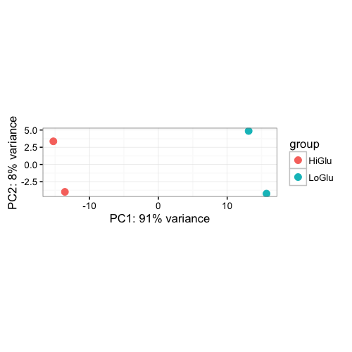
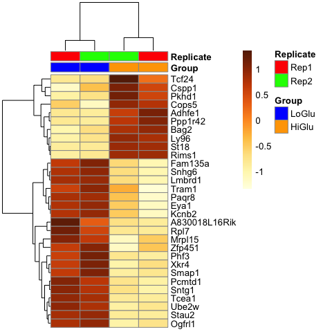
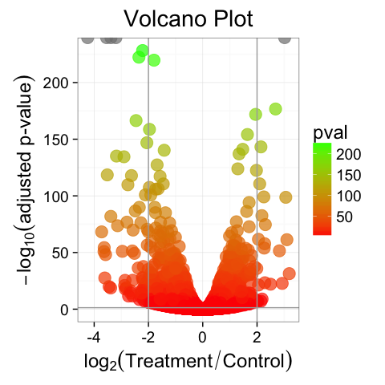
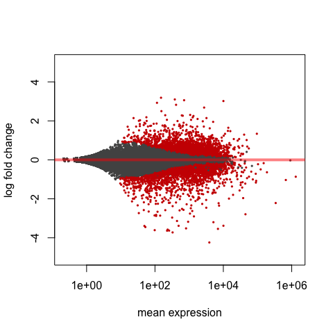
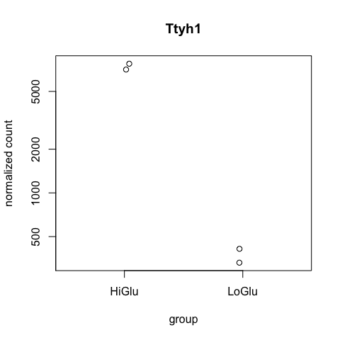
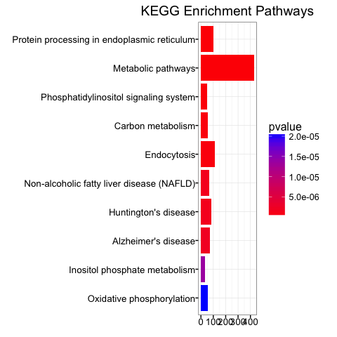
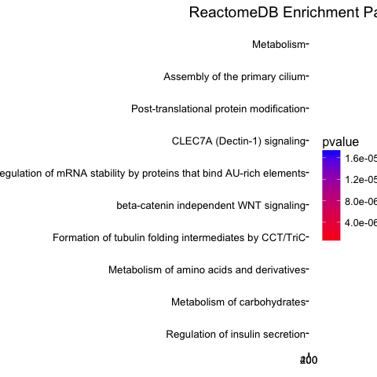
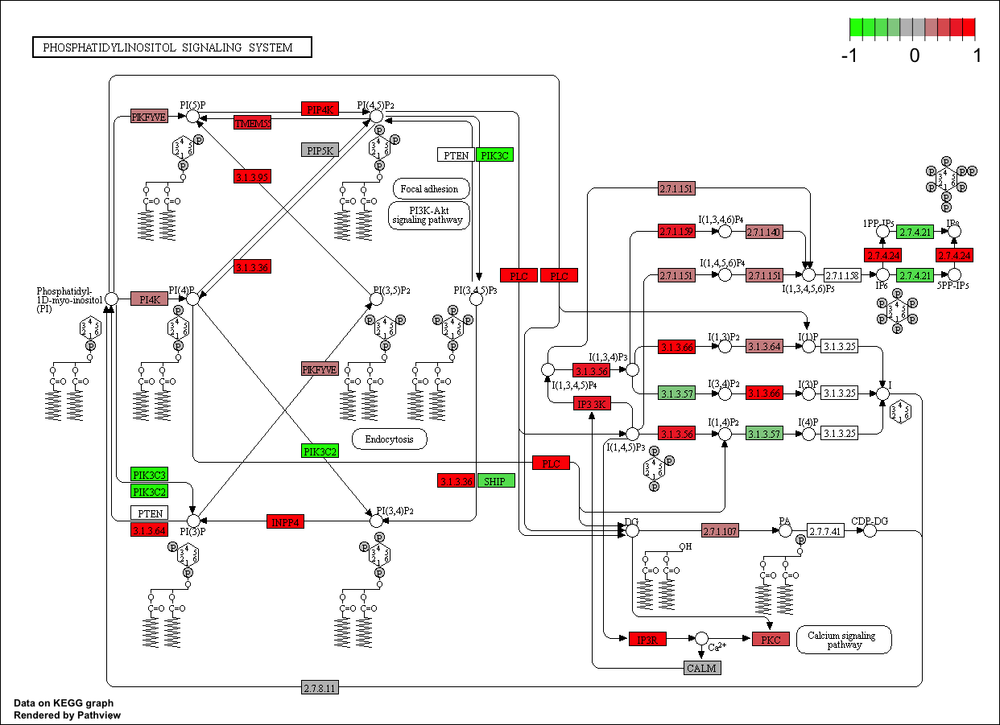

RNAseq Workflow
================
Thomas W. Battaglia
1 Sept 2016

### Introduction

RNA seq is an emerging technology for deep RNA sequencing. Not only does RNA seq technology have the ability to analyze differences in gene expression between samples, but can discover new isoforms of genes and analyze SNP variation of particular genes. This tutorial will cover the basic workflow for analyzing RNA seq data on host tissue. It will not cover the workflow for analyzing RNA seq on microbial community samples. For analysis of the meta-transcriptome using RNA seq, see the workflow for Whole Genome Sequencing Metagenomics (WGS Metagenomics) in a different tutorial.

#### 1a. Setup new directory for analysis

Many files are generated during the RNA seq workflow, so it is best to keep them stored in an organized directory. The first step before running/installing any tools, is to generate a directory structure for easier organization. The rest of this tutorial assumes your working directory (`pwd`) is within the `new_rnaseq_analysis` folder created during the first step, or whatever you choose to name the folder.

**input** : per sample sequencing files (.fastq)
**genome** : directory for storing genome of interest (.fasta/.fna)
**annotation** : directory for storing the annotation file associated with host genome (.gtf/.gff3)
**index** : directory that will store STAR aligner's index files
**tools** : directory to store dependencies required for analysis
**venv** : a virtual environment of python to store all dependencies
**logs** : a directory to store all the logs files generated from SGE

``` bash
# Make new root directory
mkdir new_rnaseq_analysis

# Change directory into new folder
cd new_rnaseq_analysis

# Make sub-directories to store:
mkdir -p input
mkdir -p genome
mkdir -p annotation
mkdir -p index
mkdir -p tools
mkdir -p logs
```

#### 1b. Setup new virtual environment to store tools

A new virtual environment will keep all the tools that are required for analysis in its own folder so that there are no errors intorduced into the system python installation and/or break and tools that require a particular version. Most of the tools require python 2.7+. After creating and activating the virtualenv, you should see `(venv)` on the command line. To check what version of python you are currently using, run the command `python --version`.

``` bash
# Load python (if not set on Python 2.7)
module load python/2.7.3

# Install the virtualenv package
pip install virtualenv --user

# Make a new virtual environment folder in the 
virtualenv venv --python=python2.7

# Start the virtualenv
source venv/bin/activate

# Create a function to link tools to virtualenv
# Sourced from http://huttenhower.sph.harvard.edu/docs/anadama_workflows/install.html#id1
function link() { ln -sv $(readlink -f "$1") $(pwd)/venv/bin/; }
```

Note: If there is an error during the virtualenv creation step that states `The executable python2.7 (from --python=python2.7) does not exist`, then the cluster environment's python version is not set for Python 2.7+, so the command `module load python/2.7.3` must be run first before running the `virtualenv venv --python=python2.7` command.

#### 1c. Download an example dataset (Optional)

If you want to use an example dataset to practice the RNAseq alignment workflow, run the commands below to place a fastq file in the `input` folder.

``` bash
# Download publically available mouse RNAseq fastq files.
# http://www.ebi.ac.uk/ena/data/view/PRJNA252388
wget -P input/ ftp://ftp.sra.ebi.ac.uk/vol1/fastq/SRR137/001/SRR1374921/SRR1374921.fastq.gz
wget -P input/ ftp://ftp.sra.ebi.ac.uk/vol1/fastq/SRR137/002/SRR1374922/SRR1374922.fastq.gz
wget -P input/ ftp://ftp.sra.ebi.ac.uk/vol1/fastq/SRR137/003/SRR1374923/SRR1374923.fastq.gz
wget -P input/ ftp://ftp.sra.ebi.ac.uk/vol1/fastq/SRR137/004/SRR1374924/SRR1374924.fastq.gz
```

Citation:
The transcriptional landscape of mouse beta cells compared to human beta cells reveals notable species differences in long non-coding RNA and protein-coding gene expression. Benner C., van der Meulen T., Cacéres E., Tigyi K., Donaldson CJ., Huising MO.BMC Genomics 15620 (2014). <https://www.ncbi.nlm.nih.gov/pmc/articles/PMC4124169/?tool=EBI>

### 2. Installing required tools

This workflow requires many different tools. Some of these tools maybe available on your cluster environment, but to ensure the correct versioning of the tools, it is suggested to install them again inside a virtual environment. See <http://docs.python-guide.org/en/latest/dev/virtualenvs/> for more information about using virtual-environments.

    Tools that are required for processing:
    a. cutadapt - adapter and base quality filtering
    b. FastQC - sequence quality analysis
    c. Trim Galore! - more easily run cutadapt and fastqc
    d. SortMeRNA - remove rRNA sequence contamination
    e. STAR-aligner - quickly align sequences to genome
    f. Subread/featureCounts - summarize alignments into gene counts
    g. MultiQC - generate a readable report of all logs

#### 2a. Install cutadapt

"Cutadapt finds and removes adapter sequences, primers, poly-A tails and other types of unwanted sequence from your high-throughput sequencing reads."

**Link:** <http://cutadapt.readthedocs.io/en/stable/guide.html>

``` bash
pip install cutadapt
```

#### 2b. Install FastQC

"FastQC aims to provide a simple way to do some quality control checks on raw sequence data coming from high throughput sequencing pipelines. It provides a modular set of analyses which you can use to give a quick impression of whether your data has any problems of which you should be aware before doing any further analysis."
**Link:** <http://www.bioinformatics.babraham.ac.uk/projects/fastqc/>

``` bash
# Download FastQC to the 'tools' folder  
wget -P tools/ http://www.bioinformatics.babraham.ac.uk/projects/fastqc/fastqc_v0.11.5.zip  

# Unzip and remove compressed file
unzip tools/fastqc_v0.11.5.zip -d tools/
rm -rf tools/fastqc_v0.11.5.zip

# Change permissions (only for fastqc tool)
chmod 777 tools/FastQC/fastqc

# Link package to virtual environment 
link tools/FastQC/fastqc

# Check if FastQC was installed properly
fastqc --version
```

#### 2c. Install Trim Galore!

"Trim Galore! is a wrapper script to automate quality and adapter trimming as well as quality control, with some added functionality to remove biased methylation positions for RRBS sequence files (for directional, non-directional (or paired-end) sequencing)."
**Link:** <http://www.bioinformatics.babraham.ac.uk/projects/trim_galore/>

``` bash
# Download Trim Galore! to the 'tools' folder
wget -P tools/ http://www.bioinformatics.babraham.ac.uk/projects/trim_galore/trim_galore_v0.4.1.zip 

# Unzip and remove compressed file
unzip tools/trim_galore_v0.4.1.zip -d tools/
rm -rf tools/trim_galore_v0.4.1.zip

# Link package to virtual environment 
link tools/trim_galore_zip/trim_galore

# Check if Trim galore! was installed properly
trim_galore --version
```

#### 2d. Install SortMeRNA

"SortMeRNA is a biological sequence analysis tool for filtering, mapping and OTU-picking NGS reads. The core algorithm is based on approximate seeds and allows for fast and sensitive analyses of nucleotide sequences. The main application of SortMeRNA is filtering rRNA from metatranscriptomic data."
**Link:** <http://bioinfo.lifl.fr/RNA/sortmerna/>

``` bash
# Download SortMeRNA to the 'tools' folder
wget -P tools/ https://github.com/biocore/sortmerna/archive/2.1.tar.gz 

# Unzip and remove compressed file
tar -zxvf tools/2.1.tar.gz -C tools/
rm -rf tools/2.1.tar.gz

# Compile scripts
cd tools/sortmerna-2.1/ && bash build.sh
cd ../..

# Link package to virtual environment 
link tools/sortmerna-2.1/indexdb_rna
link tools/sortmerna-2.1/sortmerna

# Check if SortMeRNA was installed properly
indexdb_rna -h
sortmerna --version
```

Next we need to generate an index for the SortMeRNA database.

``` bash
# Set variable for location of index files
export sortmernaDB="tools/sortmerna-2.1"

# Set location for database
sortmernaREF=${sortmernaDB}/rRNA_databases/silva-arc-16s-id95.fasta,${sortmernaDB}/index/silva-arc-16s-id95:\
${sortmernaDB}/rRNA_databases/silva-arc-23s-id98.fasta,${sortmernaDB}/index/silva-arc-23s-id98:\
${sortmernaDB}/rRNA_databases/silva-bac-16s-id90.fasta,${sortmernaDB}/index/silva-bac-16s-id95:\
${sortmernaDB}/rRNA_databases/silva-bac-23s-id98.fasta,${sortmernaDB}/index/silva-bac-23s-id98:\
${sortmernaDB}/rRNA_databases/silva-euk-18s-id95.fasta,${sortmernaDB}/index/silva-euk-18s-id95:\
${sortmernaDB}/rRNA_databases/silva-euk-28s-id98.fasta,${sortmernaDB}/index/silva-euk-28s-id98

# Generate indexs (will take ~5 minutes)
indexdb_rna --ref $sortmernaREF 
```

#### 2e. Install STAR-aligner

"Spliced Transcripts Alignment to a Reference"
**Link:** <https://github.com/alexdobin/STAR>

``` bash
# Download STAR to the 'tools' folder
wget -P tools/ https://github.com/alexdobin/STAR/archive/2.5.2b.zip

# Unzip and remove compressed file
unzip tools/2.5.2b.zip -d tools/
rm -rf tools/2.5.2b.zip

# Link package to virtual environment 
link tools/STAR-2.5.2b/bin/Linux_x86_64/STAR

# Check if STAR was installed properly
STAR --version
```

#### 2f. Install Subread

"Subread package: high-performance read alignment, quantification and mutation discovery" **Link:** <http://subread.sourceforge.net/>
**Link:** <http://bioinf.wehi.edu.au/featureCounts/>

``` bash
# Download Subread to the 'tools' folder
wget -P tools/ https://sourceforge.net/projects/subread/files/subread-1.5.1/subread-1.5.1-Linux-x86_64.tar.gz

# Unzip and remove compressed file
tar -zxvf tools/subread-1.5.1-Linux-x86_64.tar.gz -C tools/
rm -rf tools/subread-1.5.1-Linux-x86_64.tar.gz

# Link package to virtual environment 
link tools/subread-1.5.1-Linux-x86_64/bin/featureCounts

# Check if Subread (featureCounts) was installed properly
featureCounts -v
```

#### 2g. Install MultiQC

"MultiQC searches a given directory for analysis logs and compiles a HTML report. It's a general use tool, perfect for summarising the output from numerous bioinformatics tools."
**Link:** <http://multiqc.info/>

``` bash
# Install MultiQC to the virtualenv
pip install multiqc
pip install click

# Check if MultiQC was installed properly
multiqc --version
```

### 3. Download host genome and annotation file

A host genome and annotation file are required for a complete RNA seq analysis. The annotation file contains the gene information associated with the coordinates of an alignment. The two files need to places in their respective folders before running the workflow. Additionally, There are different releases of the full mouse genome, so be aware which genome and which annotation file you are using for the sequencing alignment.

#### 3a. Mouse genome

**Link:** <http://www.gencodegenes.org/mouse_releases/current.html>

``` bash
# Download mouse genome to the 'genome' folder
wget -P genome/ ftp://ftp.sanger.ac.uk/pub/gencode/Gencode_mouse/release_M10/GRCm38.p4.genome.fa.gz

# Download genome annotation file to the 'annotation' folder
wget -P annotation/ ftp://ftp.sanger.ac.uk/pub/gencode/Gencode_mouse/release_M10/gencode.vM10.annotation.gtf.gz

# Decompress
gunzip genome/GRCm38.p4.genome.fa.gz
gunzip annotation/gencode.vM10.annotation.gtf.gz
```

#### 3b. Human genome

**Link:** <http://www.gencodegenes.org/releases/current.html>

``` bash
# Download human genome to the 'genome' folder
wget -p genome/ ftp://ftp.sanger.ac.uk/pub/gencode/Gencode_human/release_25/GRCh38.p7.genome.fa.gz

# Download genome annotation file to the 'annotation' folder
wget -P annotation/ ftp://ftp.sanger.ac.uk/pub/gencode/Gencode_human/release_25/gencode.v25.annotation.gtf.gz

# Decompress
gunzip genome/GRCh38.p7.genome.fa.gz
gunzip annotation/gencode.v25.annotation.gtf.gz
```

#### 3c. Other genome

If you are not working with a mouse or human genome, see the following websites for a complete listing.
<https://genome.ucsc.edu/cgi-bin/hgGateway>
<http://useast.ensembl.org/info/data/ftp/index.html>

### 4. Generate STAR aligner index

The STAR aligner requires an index to be created before aligning any `fastq` sequences. The index command requires the host genome of interest and associated annotation file as inputs. The command is best run on the cluster, but should be submitted as a job. Download the shell file and submit it as a job. Additionally you must specific the length of the sequences in the RNAseq run in the command. This is typically 50 or 101, but will depend on what was requested.

``` bash
# Download index job file
wget https://raw.githubusercontent.com/twbattaglia/RNAseq-workflow/master/make_index.sh

# Submit the make_index.sh as a job. Set the read length to 50bp. (~45 minutes)
qsub make_index.sh 50
```

### 5. Download workflow and change parameters

Once the index has been generated and all of the tools are installed, it is time to start the alignment workflow. The workflow is stored as a shell (.sh) file which submits an array job which will iterate over each input `.fastq.gz` file.

Before submitting the command, make sure you change the variables within the file to reflect your data set.
**qualityCutoff** : The minimum Phred score to retain nucleotides \[Default = 20\]
**trimLength** : The minimum length of the sequence to keep after quality trimming. Typically 60% of the total length or greater. \[Default = 20\]

``` bash
wget https://raw.githubusercontent.com/twbattaglia/RNAseq-workflow/master/run_workflow.sh
```

### 6a. Run the workflow in parallel

The job can be submitted to the cluster once you have changed the parameters to reflect your data and you have placed the `.fastq.gz` files into the folder, `input`. The command is written to submit an array job, which means you must specify how many times the job should run. In this case it is dependent upon how many individual `.fastq.gz` files that are located in the `input` folder. If there are 6 different samples within the folder you would run the command `qsub -t 1:6 run_workflow.sh`, but if you have 10 files, you would run the command `qsub -t 1:10 run_workflow.sh`. The `-t` flag corresponds to how many different commands should be submitted.

``` bash
qsub -t 1:4 run_workflow.sh
```

**Note:** The command is written for SGE clusters, but if you have a different cluster set up, you can change the variable `$SGE_TASK_ID` to the correct array style variable.

### 6b. Process the output files and generate a report

After the main workflow has finished running, you will have generated aligned `.bam` files for each sample. These files only give the coordinates for the sequence alignments on the genome, and must be summarized to give gene counts per sample, before any statistical analysis can be performed. To do this we perform further processing the output files using the `postprocessing.sh` script There is no need for a parallel array script and the command can be submitted as is as long as no folder names/locations were not changed in main workflow step.

``` bash
wget https://raw.githubusercontent.com/twbattaglia/RNAseq-workflow/master/postprocessing.sh
qsub postprocessing.sh
```

### 6c. Outputs from running the workflow

Many files are generated after running the main workflow and the post-processing scripts. Below is a breakdown of each of the folders and their respective description of their outputs. Each step reports a log file for every sample which can be used to calculcated the number of sequences.

``` bash
── output/
│   └── 1_initial_qc/ - FastQC quality reports for each sample
│   └── 2_trimmed_output/ - Trimmed reports for each sample
│   └── 3_rRNA
│       ├── aligned/ - Sequences aligned to rRNA databases
│       ├── filtered/ - Sequences with rRNA sequences removed
│       ├── logs/ - Logs from running SortMeRNA
│   └── 4_aligned_sequences
│       ├── aligned_bam/ - Main alignment files for each sample
│       ├── aligned_logs/ - Log from running STAR alignment step
│       ├── aligned_counts/ - STAR alignment counts output (for comparison with featureCounts)
│   └── 5_final_counts - Final gene count summarization output from running featureCounts
│   └── 6_multiQC - Overall workflow report
```

### 7. Differential expression analysis using R

Once the workflow has completed, you can now use the gene count table as an input into DESeq2 for statistical analysis using the R-programming language. It is highly reccomended to use **RStudio** when writing R code and generating R-related analyses. You can download RStudio for your system here: <https://www.rstudio.com/products/rstudio/download/>

#### 7a. Generate a metadata file

One additional required file which is needed is a type of metadata file. This can be created in R or it can be imported as a text file. The mapping file must have sample identifiers that match the the resulting table with more columns that describe the sample (e.g Treatment).

#### 7b. Install required R-libraries

Multiple libraries are required to perform analysis, plotting and enrichment.

``` r
source("https://bioconductor.org/biocLite.R")
biocLite("DESeq2")
biocLite("ggplot2")
biocLite("clusterProfiler")
biocLite("biomaRt")
biocLite("ReactomePA")
biocLite("DOSE")
biocLite("KEGG.db")
biocLite("pathview")
biocLite("org.Mm.eg.db")
biocLite("org.Hs.eg.db")
biocLite("pheatmap")
biocLite("genefilter")
biocLite("RColorBrewer")
biocLite("topGO")
biocLite("dplyr")
```

#### 7c. Using featureCounts output

One you have an R environment appropriatley set up, you can begin to import the featureCounts output of genes counts, found within the `5_final_counts` folder. This tutorial will use DESeq2 to normalize and perform the statistical analysis between sample groups. Be sure to copy the `final_counts.txt` file generate from featureCounts step to your set working directory, or specify the full location when importing the table. <br>
If you would like to use an example featureCounts output, download the gene counts and metadata here:
<https://raw.githubusercontent.com/twbattaglia/RNAseq-workflow/master/example/final_counts.txt> **(Save Link As...)**
<https://raw.githubusercontent.com/twbattaglia/RNAseq-workflow/master/example/metadata.txt> **(Save Link As...)**

------------------------------------------------------------------------

##### Import gene counts information from featureCounts output.

``` r
# - - - - - - - - - - - - - - -
# Load required libraries and
# set up environment
# - - - - - - - - - - - - - - -
library(DESeq2) # statistical analysis 
library(ggplot2) # plotting 
library(knitr) # for better formatting


# - - - - - - - - - - - - - - -
# Import featureCounts data
# - - - - - - - - - - - - - - -

# Import gene counts table
# - skip first row (general command info)
# - make row names the gene identifiers
countdata <- read.table("example/final_counts.txt", header = TRUE, skip = 1, row.names = 1)

# Remove .bam + '..' from column identifiers
colnames(countdata) <- gsub(".bam", "", colnames(countdata), fixed = T)
colnames(countdata) <- gsub("..", "", colnames(countdata), fixed = T)

# Remove length/char columns
countdata <- countdata[ ,c(-1:-5)]

# Make sure ID's are correct
head(countdata)
```

    ##               SRR1374924 SRR1374923 SRR1374921 SRR1374922
    ## 4933401J01Rik          0          0          0          0
    ## Gm26206                0          0          0          0
    ## Xkr4                 214        302        459        425
    ## Gm18956                0          0          0          0
    ## Gm37180                4          2          3          1
    ## Gm37363                1          0          0          1

------------------------------------------------------------------------

##### Import metadata text file. The SampleID's must be the first column

``` r
# Import metadata file
# - make row names the matching sampleID's from the countdata
metadata <- read.delim("example/metadata.txt", row.names = 1)

# Add sampleID's to the mapping file
metadata$sampleid <- row.names(metadata)

# Reorder sampleID's to match featureCounts column order. 
metadata <- metadata[match(colnames(countdata), metadata$sampleid), ]

# Make sure ID's are correct
head(metadata)
```

    ##            Group Replicate   sampleid
    ## SRR1374924 HiGlu      Rep2 SRR1374924
    ## SRR1374923 HiGlu      Rep1 SRR1374923
    ## SRR1374921 LoGlu      Rep1 SRR1374921
    ## SRR1374922 LoGlu      Rep2 SRR1374922

------------------------------------------------------------------------

##### Make DESeq2 object from counts and metadata

``` r
# - countData : count dataframe
# - colData : sample metadata in the dataframe with row names as sampleID's
# - design : The design of the comparisons to use. 
#            Use (~) before the name of the column variable to compare
ddsMat <- DESeqDataSetFromMatrix(countData = countdata,
                                 colData = metadata,
                                 design = ~Group)


# Find differential expressed genes
# Run DESEq2
ddsMat <- DESeq(ddsMat)
```

    ## estimating size factors

    ## estimating dispersions

    ## gene-wise dispersion estimates

    ## mean-dispersion relationship

    ## final dispersion estimates

    ## fitting model and testing

------------------------------------------------------------------------

##### View results from statistical analysis

``` r
# Get results from testing with FDR adjust pvalues
res <- results(ddsMat, pAdjustMethod = "fdr", alpha = 0.05)

# Generate summary of testing. 
summary(res)
```

    ## 
    ## out of 28681 with nonzero total read count
    ## adjusted p-value < 0.05
    ## LFC > 0 (up)     : 3093, 11% 
    ## LFC < 0 (down)   : 2424, 8.5% 
    ## outliers [1]     : 0, 0% 
    ## low counts [2]   : 12328, 43% 
    ## (mean count < 9)
    ## [1] see 'cooksCutoff' argument of ?results
    ## [2] see 'independentFiltering' argument of ?results

``` r
# Find the directionality of the fold change 
mcols(res, use.names = T)
```

    ## DataFrame with 6 rows and 2 columns
    ##                        type                                  description
    ##                 <character>                                  <character>
    ## baseMean       intermediate    mean of normalized counts for all samples
    ## log2FoldChange      results log2 fold change (MAP): Group LoGlu vs HiGlu
    ## lfcSE               results         standard error: Group LoGlu vs HiGlu
    ## stat                results         Wald statistic: Group LoGlu vs HiGlu
    ## pvalue              results      Wald test p-value: Group LoGlu vs HiGlu
    ## padj                results                        fdr adjusted p-values

### 8. Gene annotation

#### 8a. Gathering gene annotation information

``` r
library(AnnotationDbi)
library(org.Mm.eg.db)

# Add gene full name
res$description <- mapIds(x = org.Mm.eg.db,
                          keys = row.names(res),
                          column = "GENENAME",
                          keytype = "SYMBOL",
                          multiVals = "first")

# Add gene symbol
res$symbol <- row.names(res)

# Add ENTREZ ID
res$entrez <- mapIds(x = org.Mm.eg.db,
                     keys = row.names(res),
                     column = "ENTREZID",
                     keytype = "SYMBOL",
                     multiVals = "first")

# Subset for only significant genes (q < 0.05)
res_sig <- subset(res, padj < 0.05)
head(res_sig)
```

    ## log2 fold change (MAP): Group LoGlu vs HiGlu 
    ## Wald test p-value: Group LoGlu vs HiGlu 
    ## DataFrame with 6 rows and 9 columns
    ##         baseMean log2FoldChange      lfcSE       stat       pvalue
    ##        <numeric>      <numeric>  <numeric>  <numeric>    <numeric>
    ## Xkr4    343.8983      0.6473508 0.16708763   3.874319 1.069232e-04
    ## Mrpl15  862.4650      0.4024633 0.11708712   3.437298 5.875488e-04
    ## Tcea1   934.4692      1.3999089 0.11330340  12.355400 4.554828e-35
    ## St18   4875.8787     -0.9960725 0.06734494 -14.790606 1.684298e-49
    ## Pcmtd1 2073.1050      0.3941010 0.08469429   4.653218 3.267944e-06
    ## Sntg1   477.0359      0.7368634 0.14501538   5.081278 3.749043e-07
    ##                padj
    ##           <numeric>
    ## Xkr4   5.981918e-04
    ## Mrpl15 2.729132e-03
    ## Tcea1  3.475809e-33
    ## St18   2.314565e-47
    ## Pcmtd1 2.548435e-05
    ## Sntg1  3.487378e-06
    ##                                                                         description
    ##                                                                         <character>
    ## Xkr4                           X Kell blood group precursor related family member 4
    ## Mrpl15                                          mitochondrial ribosomal protein L15
    ## Tcea1                                     transcription elongation factor A (SII) 1
    ## St18                                               suppression of tumorigenicity 18
    ## Pcmtd1 protein-L-isoaspartate (D-aspartate) O-methyltransferase domain containing 1
    ## Sntg1                                                           syntrophin, gamma 1
    ##             symbol      entrez
    ##        <character> <character>
    ## Xkr4          Xkr4      497097
    ## Mrpl15      Mrpl15       27395
    ## Tcea1        Tcea1       21399
    ## St18          St18      240690
    ## Pcmtd1      Pcmtd1      319263
    ## Sntg1        Sntg1       71096

#### 8b. Write all the important results to .txt files

``` r
# Write normalized gene counts to a .txt file
write.table(x = as.data.frame(counts(ddsMat), normalized = T), 
            file = 'DESeq2_normalized_counts.txt', 
            sep = '\t', 
            quote = F,
            col.names = NA)

# Write significant normalized gene counts to a .txt file
write.table(x = counts(ddsMat[row.names(res_sig)], normalized = T), 
            file = 'DESeq2_normalized_counts_significant.txt', 
            sep = '\t', 
            quote = F, 
            col.names = NA)
            
# Write the annotated results table to a .txt file
write.table(x = as.data.frame(res), 
            file = "DESEq2_results_gene_annotated.txt", 
            sep = '\t', 
            quote = F,
            col.names = NA)

# Write significant annotated results table to a .txt file
write.table(x = as.data.frame(res_sig), 
            file = "DESEq2_results_gene_annotated_significant.txt", 
            sep = '\t', 
            quote = F,
            col.names = NA)
```

### 9. Plotting gene data

#### 9a. PCA of highest variance genes

``` r
# Convert all samples to rlog
ddsMat_rlog <- rlog(ddsMat, blind = FALSE)

# Plot PCA by column variable
plotPCA(ddsMat_rlog, intgroup = "Group", ntop = 500) +
  theme_bw() # remove default ggplot2 theme
```

 \*\*\*

#### 9b. Heatmap of significant genes

``` r
# Load libraries
library(pheatmap) # heatmap package
library(RColorBrewer) # better colors package

# Convert all samples to rlog
ddsMat_rlog <- rlog(ddsMat, blind = FALSE)

# Gather top 30 genes and make matrix
mat <- assay(ddsMat_rlog[row.names(res_sig)])[1:30, ]

# Choose which column variables you want to annotate the columns by.
annotation_col = data.frame(
  Group = factor(colData(ddsMat_rlog)$Group),
  Replicate = factor(colData(ddsMat_rlog)$Replicate),
  row.names = colData(ddsMat_rlog)$sampleid
)

# Specify colors you want to annotate the columns by.
ann_colors = list(
    Group = c("LoGlu" = "blue", "HiGlu" = "orange"),
    Replicate = c(Rep1 = "red", Rep2 = "green")
)

# Make Heatmap with pheatmap function.
# See more in documentation for customization
pheatmap(mat = mat, 
         color = colorRampPalette(brewer.pal(9, "YlOrBr"))(255), 
         scale = "row", 
         annotation_col = annotation_col, 
         annotation_colors = ann_colors, 
         show_colnames = F)
```

 \*\*\*

#### 9c. Volcano plot

``` r
# Load libraries
library(ggplot2)
library(RColorBrewer)

# Gather Log-fold change and FDR-corrected pvalues from deseq2 results
data <- data.frame(pval = -log10(res$padj), 
                   lfc = res$log2FoldChange, 
                   row.names = row.names(res))

# Remove any rows that have NA as an entry
data <- na.omit(data)

# Make a basic ggplot2 object with x-y values
vol <- ggplot(data, aes(x = lfc, y = pval))

# Add ggplot2 layers
vol +   
  ggtitle(label = "Volcano Plot") +
  geom_point(aes(colour = pval), size = 5, alpha = 0.7, na.rm = T) + # color the dots
  theme_bw(base_size = 18) + # change overall theme
  theme(legend.position = "right") + # change the legend
  xlab(expression(log[2]("Treatment" / "Control"))) + # Change X-Axis label
  ylab(expression(-log[10]("adjusted p-value"))) + # Change Y-Axis label
  geom_vline(xintercept = c(-2, 2), colour = "darkgrey") + # Add fold change cutoff lines
  geom_hline(yintercept = 1.3, colour = "darkgrey") + # Add p-adj value cutoff line
  scale_colour_gradient(low = "red", high = "green") # Add red-green scaling by intensity
```

 \*\*\*

#### 9d. MA plot

``` r
plotMA(res, ylim = c(-5, 5))
```

 \*\*\*

#### 9e. Plotting a single gene

``` r
# Convert all samples to rlog
ddsMat_rlog <- rlog(ddsMat, blind = FALSE)

# Get gene with highest expression
top_gene <- rownames(res)[which.min(res$log2FoldChange)]

# Plot single gene
plotCounts(ddsMat, gene = "Ttyh1", intgroup = "Group")
```



### 10. Pathway analysis on differentially expressed genes.

The code below assumes you have RNA seq results from the mouse genome.
Get more information about clusterProfiler here: <http://bioconductor.org/packages/release/bioc/vignettes/clusterProfiler/inst/doc/clusterProfiler.html>

#### Prepare data for use with clusterProfiler

``` r
# Load required libraries
library(clusterProfiler)
library(ReactomePA)
library(KEGG.db)
library(DOSE)
library(org.Mm.eg.db)

# Remove any genes that do not have any entrez identifiers
res_sig_entrez <- subset(res_sig, is.na(entrez) == FALSE)

# Create a matrix of gene log2 fold changes
gene_matrix <- res_sig_entrez$log2FoldChange

# Add the entrezID's as names for each logFC entry
names(gene_matrix) <- res_sig_entrez$entrez
```

------------------------------------------------------------------------

#### 10a. Use KEGG gene database

``` r
# - - - - - - - - - - - - - 
# Enrich with KEGG database
# - - - - - - - - - - - - - 
kegg_enrich <- enrichKEGG(gene = names(gene_matrix),
                 organism = 'mouse',
                 pvalueCutoff = 0.05, 
                 readable = TRUE)
                 
# Get table of results
head(summary(kegg_enrich))
```

    ##                ID                                 Description GeneRatio
    ## mmu04141 mmu04141 Protein processing in endoplasmic reticulum   99/2061
    ## mmu01100 mmu01100                          Metabolic pathways  430/2061
    ## mmu04070 mmu04070       Phosphatidylinositol signaling system   51/2061
    ## mmu01200 mmu01200                           Carbon metabolism   56/2061
    ## mmu04144 mmu04144                                 Endocytosis  115/2061
    ## mmu04932 mmu04932   Non-alcoholic fatty liver disease (NAFLD)   68/2061
    ##            BgRatio       pvalue     p.adjust       qvalue
    ## mmu04141  167/7926 4.740881e-20 1.379596e-17 9.581569e-18
    ## mmu01100 1286/7926 4.950205e-11 7.202549e-09 5.002313e-09
    ## mmu04070   98/7926 2.883078e-08 2.796586e-06 1.942284e-06
    ## mmu01200  117/7926 2.574807e-07 1.873172e-05 1.300955e-05
    ## mmu04144  294/7926 3.607097e-07 2.099330e-05 1.458026e-05
    ## mmu04932  157/7926 1.536575e-06 6.659126e-05 4.624895e-05
    ##                                                                                                                                                                                                                                                                                                                                                                                                                                                                                                                                                                                                                                                                                                                                                                                                                                                                                                                                                                                                                                                                                                                                                                                                                                                                                                                                                                                                                                                                                                                                                                                                                                                                                                                                                                                                                                                                                                                                                                                                                                                                                                                                                                                                                                                                                                                                                                                                                                                                                                                                                                                                                                                                        geneID
    ## mmu04141                                                                                                                                                                                                                                                                                                                                                                                                                                                                                                                                                                                                                                                                                                                                                                                                                                                                                                                                                                                                                                                                                                                                                                                                                                                                                                                                                                                                                                                                                                                                                                                                                                                                                                                                                                                                                                                                                                                                                                                                                        Tram1/Bag2/Uggt1/Dnajb2/Atf6/Man1b1/Traf2/Hspa5/Dnajc10/Eif2ak4/Pdia3/Sec23b/Edem2/Dnajc5/Hspa4l/Ssr3/Ubqln4/Ssr2/Sec24d/Ube2d3/Ube2j1/Bag1/Vcp/Plaa/Fbxo6/Fbxo2/Wfs1/Sec31a/Mapk10/Hsph1/Cul1/Pdia4/Mogs/Rpn1/Sec61a1/Edem1/Sec13/Hspbp1/Ppp1r15a/Svip/Tusc3/Dnajb1/Rad23a/Calr/Dnaja2/Amfr/Herpud1/Mbtps1/Prkcsh/Hspa8/Hyou1/Cryab/Stt3b/Sec63/Man1a/Sar1a/Ube2d1/Derl3/Ube2g2/Hsp90b1/Ddit3/Rnf185/Xbp1/Sec61g/Erlec1/Mapk9/Canx/Sar1b/Derl2/Ern1/Nploc4/P4hb/Pdia6/Hspa2/Sel1l/Atxn3/Hsp90aa1/Ero1lb/Txndc5/Ubqln1/Ngly1/Sec24c/Ero1l/Dad1/Derl1/Atf4/Rbx1/Ufd1l/Dnajb11/Park2/Hsp90ab1/Ubxn6/Eif2ak2/Sil1/Lman1/Ganab/Bcap31/Ssr4/Mbtps2
    ## mmu01100 Inpp4a/Gls/Inpp1/Pgap1/Aox1/Ndufb3/Idh1/Rpe/Atic/Chpf/Acsl3/Dgkd/Ugt1a9/Scly/Pign/Kdsr/B3galt2/Ptgs2/Glul/Uck2/Uap1/Sdhc/Ndufs2/Fh1/Kmo/Adss/Itpkb/Pycr2/Degs1/Bpnt1/Eprs/Man1b1/Uap1l1/Inpp5e/Agpat2/Ak1/B3galt1/G6pc2/Dhrs9/Atp5g3/Agps/Dgkz/Hsd17b12/Apip/Itpka/Sord/Gatm/Dut/Polr1b/Plcb1/Pigu/Ggt7/Acss2/Gss/Atp5e/Lama5/Mccc1/Ndufc1/Plch1/Slc33a1/Gmps/B3galnt1/Tdo2/Gatb/Pklr/Dpm3/Pmvk/Pip5k1a/Cers2/Polr3gl/Ampd2/Agl/Alg14/Gclm/Ndst4/Cyp2u1/Sgms2/Adh7/Adh5/Ccbl2/Uox/Ak5/St6galnac5/Fpgt/Cth/Aco1/Pigo/Gba2/Gne/Grhpr/Alg2/Aldob/Ugcg/Alad/Atp6v1g1/Acer2/Mtap/Cyp2j6/Alg6/Pgm2/Ak4/Scp2/Uqcrh/Akr1a1/St3gal3/Hyi/Ctps/Inpp5b/Extl1/Gale/Pla2g2f/Aldh4a1/Sdhb/Pgd/Eno1/Fam213b/Nadk/B3galt6/Chpf2/Hadha/Khk/Cad/Lap3/Pi4k2b/Gnpda2/Ppat/Paics/Ugt2b34/Enoph1/Atp5k/Idua/Mmab/Acads/Coq5/Gatc/Cox6a1/Gusb/Atp5j2/Pon2/C1galt1/Ndufa4/Aass/Akr1b8/Ndufb2/Tpk1/Atp6v0e2/Hibadh/Nt5c3/Polr1a/St3gal5/Mat2a/Mogs/Mthfd2/Dguok/Gfpt1/Rpn1/Mgll/Suclg2/Csgalnact2/Eno2/Tpi1/Gapdh/Cmas/St8sia1/Etnk1/Ndufa3/Pafah1b3/Cyp2s1/Pld3/Prodh2/Cox6b1/Gpi1/Pold1/Bcat2/Fut1/Sphk2/Ldha/Aldh1a3/Anpep/Idh2/Me3/Ndufc2/Dgat2/Pik3c2a/Ears2/Aldoa/Cdipt/Sephs2/Cox6a2/Acadsb/Oat/Inpp5a/Echs1/Ptdss2/Th/Cers4/Tusc3/Mtmr7/Asah1/Acsl1/Dctd/B3gnt3/Inpp4b/Ndufb7/Gcdh/Gpt2/Tk2/Smpd3/Fuk/Gcsh/Bco1/Plcg2/Galns/Ntpcr/Mtmr2/Dnmt1/Acad8/Dpagt1/Pafah1b2/Pts/Sdhd/Acat1/Acsbg1/Cox5a/Pkm/Glce/Pigb/Hmgcll1/Gclc/Bckdhb/Nmnat3/Acy1/Gmppb/Nme6/Stt3b/Acaa1a/Xylb/Mthfd1l/Dse/Rev3l/Smpd2/Man1a/Sgpl1/Hk1/Hkdc1/Ado/Ipmk/Lss/Pfkl/Agpat3/Pdxk/Atp5d/Ndufs7/Uqcr11/Pip5k1c/Galnt4/Tph2/Ndufa4l2/Prim1/Ptges3/Atp5b/Gls2/Dgka/Mtmr3/Pgam2/Pold2/Gck/Ogdh/Upp1/Ddc/Mdh1/Mat2b/Mgat4b/Uqcrq/Acsl6/Guk1/Nt5m/Aldh3a2/Pigl/Polr2a/Acadvl/Pafah1b1/Srr/Inpp5k/Aldoc/Mtmr4/Dgke/Nme1/Atp5g1/Pnpo/Acly/Coasy/Aoc2/Aoc3/Galk1/Afmid/Sgsh/Pycr1/Dcxr/Dnmt3a/Lpin1/Odc1/Mboat2/Cmpk2/Adi1/Dld/Twistnb/Pygl/Mthfd1/Atp6v1d/Rdh11/Aldh6a1/Dlst/Gstz1/Sptlc2/Itpk1/Degs2/Ckb/Pfkp/Mtr/Aldh5a1/Uqcrfs1/Gcnt2/Fbp2/Fbp1/Sdha/Mccc2/Nnt/Hmgcs1/Acox2/Adk/Polr3a/Chdh/Gch1/Dad1/Polr3d/Dgkh/Nadk2/Agxt2/Amacr/Cox6c/Rrm2b/Atp6v1c1/Ndufb9/Sqle/St3gal1/Dgat1/Polr3h/Pmm1/Pnpla3/Alg12/Chkb/Alg10b/Abat/Dgkg/St6gal1/Pcyt1a/Umps/B4galt4/Atp6v1a/Cpox/Gbe1/Atp5j/Atp5o/Hlcs/B3galt5/Synj2/Agpat4/Atp6v0c/Pgp/Ndufb10/Nme4/Atp6v0e/Ndufv3/Cbs/Cyp4f13/Atp6v1g2/Mut/Polr1c/Ndufa11/Man2a1/Galnt14/Xdh/Lama3/Galnt1/Polr2d/Ndufa2/Gnpda1/Eno1b/Chsy3/Ndst1/Acaa2/St8sia5/Atp5a1/Chka/Pcx/Plcb3/Cox8a/Ganab/Gcnt1/Nmrk1/Pip5k1b/Gldc/Sgms1/Papss2/Aldh18a1/Pgam1/Got1/Ndufb8/Acsl5/Ebp/Maoa/Maob/Rgn/Ndufa1/C1galt1c1/Ocrl/Hprt/Ids/Mtm1/Mtmr1/Atp6ap1/G6pdx/Pcyt1b/Cox7b/Pgk1/Prps1/Acsl4/Sat1/Prps2
    ## mmu04070                                                                                                                                                                                                                                                                                                                                                                                                                                                                                                                                                                                                                                                                                                                                                                                                                                                                                                                                                                                                                                                                                                                                                                                                                                                                                                                                                                                                                                                                                                                                                                                                                                                                                                                                                                                                                                                                                                                                                                                                                                                                                                                                                                                                                                                                                                                             Inpp4a/Inpp1/Pikfyve/Inpp5d/Dgkd/Ppip5k2/Itpkb/Pip4k2a/Inpp5e/Dgkz/Itpka/Ppip5k1/Plcb1/Pip5k1a/Tmem55a/Pik3r3/Inpp5b/Pi4k2b/Itpr1/Itpr2/Calm3/Pik3c2a/Prkcb/Cdipt/Inpp5a/Mtmr7/Inpp4b/Plcg2/Mtmr2/Ip6k2/Ipmk/Pip5k1c/Dgka/Mtmr3/Inpp5k/Mtmr4/Dgke/Pip4k2b/Prkca/Calm1/Itpk1/Pik3r1/Tmem55b/Dgkh/Dgkg/Synj2/Plcb3/Pip5k1b/Ocrl/Mtm1/Mtmr1
    ## mmu01200                                                                                                                                                                                                                                                                                                                                                                                                                                                                                                                                                                                                                                                                                                                                                                                                                                                                                                                                                                                                                                                                                                                                                                                                                                                                                                                                                                                                                                                                                                                                                                                                                                                                                                                                                                                                                                                                                                                                                                                                                                                                                                                                                                                                                                                                                                                                                                       Idh1/Rpe/Sdhc/Fh1/Cat/Acss2/Pklr/Adh5/Aco1/Aldob/Sdhb/Pgd/Eno1/Hadha/Acads/Suclg2/Eno2/Tpi1/Gapdh/Gpi1/Idh2/Me3/Aldoa/Echs1/Gpt2/Sdhd/Acat1/Pkm/Hk1/Hkdc1/Pfkl/Pgam2/Gck/Ogdh/Mdh1/Aldoc/Dld/Aldh6a1/Dlst/Pfkp/Fbp2/Fbp1/Sdha/Esd/Pgp/Mut/Eno1b/Pcx/Gldc/Pgam1/Got1/Rgn/G6pdx/Pgk1/Prps1/Prps2
    ## mmu04144                                                                                                                                                                                                                                                                                                                                                                                                                                                                                                                                                                                                                                                                                                                                                                                                                                                                                                                                                                                                                                                                                                                                                                                                                                                                                                                                                                                                                                                                                                                                                                                                                                                                                                                                                                                                                                                                                                                   Smap1/Agap1/Vps4b/Cxcr4/Arpc5/Dnm3/Stam/Psd4/Arpc5l/Kif5c/Stam2/Traf6/Arfgef2/Pard6b/Rab22a/Arfgap1/Prkci/Spg20/Pip5k1a/Vps45/Sh3glb1/Wwp1/Chmp5/Clta/Tgfbr1/Zfyve9/Smap2/Cdc42/Capzb/Prkcz/Adrbk2/Git2/Vps29/Arpc3/Cyth3/Arpc1b/Flt1/Met/Wipf3/Chmp3/Stambp/Rab11fip5/Rbsn/Fam21/Ret/Iqsec3/Epn1/Ap2s1/Cblc/Tgfb1/Cyth2/Igf1r/Arrb1/Folr1/Vps36/Vps37a/Mvb12a/Rab8a/Vps35/Rab4a/Pard3/Dnm2/Ldlr/Hspa8/Pml/Spg21/Pdcd6ip/Ccr5/Snx3/Vps26a/Pip5k1c/A230046K03Rik/Ccdc53/Eea1/Kif5a/Rnf41/Rab5b/Rufy1/Arrb2/Rabep1/Git1/Ap2b1/Cltc/Wipf2/Cyth1/Chmp6/Hspa2/Tgfb3/Cltb/Grk6/Zfyve16/E430025E21Rik/Cyth4/Arf3/Ap2m1/Tfrc/Snx4/Chmp2b/Rab11b/H2-K1/H2-D1/H2-Q7/H2-T23/Arap3/Snx2/Nedd4l/Smad2/Snx32/Vps37c/Pip5k1b/Zfyve27/Gbf1/Rab11fip2/Snx12/Sh3kbp1
    ## mmu04932                                                                                                                                                                                                                                                                                                                                                                                                                                                                                                                                                                                                                                                                                                                                                                                                                                                                                                                                                                                                                                                                                                                                                                                                                                                                                                                                                                                                                                                                                                                                                                                                                                                                                                                                                                                                                                                                                                                                                                                                                                                                                                                                                                                                                           Ndufb3/Irs1/Adipor1/Sdhc/Ndufs2/Akt3/Traf2/Nr1h3/Il1b/Ndufc1/Pklr/Il6ra/Jun/Prkaa2/Uqcrh/Pik3r3/Cdc42/Sdhb/Mapk10/Cox6a1/Mlxipl/Ndufa4/Ndufb2/Adipor2/Bid/Ndufa3/Gsk3a/Tgfb1/Akt2/Cox7a1/Cox6b1/Ndufc2/Cox6a2/Ins2/Insr/Irs2/Ndufb7/Sdhd/Cox5a/Cox7a2/Ndufs7/Uqcr11/Ddit3/Ndufa4l2/Xbp1/Mapk9/Uqcrq/Srebf1/Mlx/Ern1/Socs3/Uqcrfs1/Sdha/Pik3r1/Cox6c/Ndufb9/Atf4/Gsk3b/Ndufb10/Ndufv3/Ndufa11/Cox7a2l/Ndufa2/Cox8a/Ndufb8/Ins1/Ndufa1/Cox7b
    ##          Count
    ## mmu04141    99
    ## mmu01100   430
    ## mmu04070    51
    ## mmu01200    56
    ## mmu04144   115
    ## mmu04932    68

``` r
# Plot results
barplot(kegg_enrich, drop=TRUE, 
        showCategory=10, 
        title = "KEGG Enrichment Pathways",
        font.size = 8)
```



#### 10b. Use ReactomeDB database

``` r
# - - - - - - - - - - - - - 
# Enrich with ReactomeDB
# - - - - - - - - - - - - - 
reactome_enrich <- enrichPathway(gene = names(gene_matrix), 
                                 organism = 'mouse', 
                                 pvalueCutoff = 0.05)
                 
# Get table of results
head(summary(reactome_enrich))
```

    ##              ID
    ## 5991024 5991024
    ## 5992376 5992376
    ## 5991488 5991488
    ## 5991181 5991181
    ## 5992028 5992028
    ## 5991560 5991560
    ##                                                                 Description
    ## 5991024                                                          Metabolism
    ## 5992376                                      Assembly of the primary cilium
    ## 5991488                             Post-translational protein modification
    ## 5991181                                         CLEC7A (Dectin-1) signaling
    ## 5992028 Regulation of mRNA stability by proteins that bind AU-rich elements
    ## 5991560                              beta-catenin independent WNT signaling
    ##         GeneRatio   BgRatio       pvalue     p.adjust       qvalue
    ## 5991024  542/1903 1535/7111 3.674252e-17 4.104140e-14 3.291356e-14
    ## 5992376   71/1903  159/7111 6.962401e-07 3.888501e-04 3.118423e-04
    ## 5991488  113/1903  287/7111 1.393112e-06 5.187022e-04 4.159785e-04
    ## 5991181   48/1903   99/7111 2.735106e-06 7.637782e-04 6.125197e-04
    ## 5992028   44/1903   89/7111 3.690326e-06 8.244188e-04 6.611510e-04
    ## 5991560   50/1903  106/7111 4.653149e-06 8.662612e-04 6.947069e-04
    ##                                                                                                                                                                                                                                                                                                                                                                                                                                                                                                                                                                                                                                                                                                                                                                                                                                                                                                                                                                                                                                                                                                                                                                                                                                                                                                                                                                                                                                                                                                                                                                                                                                                                                                                                                                                                                                                                                                                                                                                                                                                                                                                                                                                                                                                                                                                                                                                                                                                                                                                                                                                                                                                                                                                                                                                                                                                                                                                                                                                                                                                                                                                                                                                                                                                                                                                                                                                                                                                                                                                geneID
    ## 5991024 76187/68421/50785/269180/14660/16329/11761/66495/15926/18711/66646/108147/74241/433323/74205/70247/16331/98314/227399/70750/72999/19225/14645/116914/70456/80914/66052/226646/14194/98256/11566/320404/13244/23827/226856/170768/30963/18718/64436/67512/227720/11636/20910/19177/14571/329416/14378/27413/78830/228026/56508/228033/228061/59015/66461/19182/76969/56348/12505/56369/12359/56398/228550/327655/20322/67092/59010/110074/26371/228608/54338/74182/18795/20614/56406/60525/14854/56336/66679/56491/14683/67126/229003/16592/11770/27357/81004/20526/14696/72039/66377/269437/229363/66841/56720/18770/68603/19172/18720/76893/109905/14862/14865/109674/26442/77559/213603/14630/69608/71519/74442/11529/229905/23908/229949/107869/70568/230101/76238/230163/11303/22166/67103/22234/17025/230379/66902/13110/72157/108079/12896/20280/66576/18710/20441/20525/51797/16330/74246/26971/212647/67680/110208/56485/13806/66469/192185/117592/19181/100910/231070/97212/16548/330064/69719/19046/67073/231327/67054/14473/269113/67870/11958/15932/77697/11409/52064/12861/19047/67151/110006/58805/11423/19085/59031/57423/66066/17992/30956/68198/29807/58875/107569/26357/14701/232087/27369/23945/54563/20917/58911/16438/78752/12288/20527/14792/13807/21991/14433/75320/16439/66091/53420/12315/66071/74134/18807/23996/57296/110323/233081/14751/110826/18971/18226/14936/12036/56632/16514/16828/269951/170460/68197/67800/22228/269966/114332/26440/18704/11674/52858/66885/77590/18242/212111/93747/23997/27388/16334/21823/67260/18408/20845/54384/11886/11739/14081/320685/16956/72297/234515/66916/12286/270076/108682/109151/71805/109006/57813/382051/58994/234729/234779/56453/50917/68865/67618/77116/68165/13430/59035/16835/76898/66948/19286/66925/110446/12858/18746/93683/18247/14629/83603/12040/74080/75669/109652/14775/57279/19087/76500/235623/333433/113868/67469/70337/338362/212898/17118/103199/20598/19156/13180/20397/15275/69718/16987/20509/18641/28169/216134/12215/20869/66043/75406/66594/18245/18717/58250/192188/69736/216343/56351/11947/216456/21452/74302/56012/103988/18293/432530/22271/13195/17449/103554/108645/66397/22272/216739/14923/103850/20787/20185/22318/11370/19062/11676/52466/170749/18102/11951/103711/108083/19014/22123/104112/71743/21428/19192/19184/66997/18750/74008/19084/445007/14635/71562/27029/14527/18453/209027/80879/17977/14245/18263/67216/104923/13382/67452/217666/110095/81535/108156/77219/104776/78920/14874/20773/19179/12313/19141/217837/70059/15519/12709/105387/27384/432720/56421/238505/14706/19166/66694/380840/54326/218210/22017/14120/14121/210009/66945/93692/13003/78038/18708/74559/208715/93732/66413/14702/218811/11534/56794/14528/19173/71844/12153/213484/67041/268782/17117/15529/12864/382985/54375/66218/20775/20442/13350/109754/116939/223753/12651/11883/11842/223921/20683/12914/15369/17250/27416/21762/13026/22247/56375/12892/74185/11957/28080/110948/20975/68262/13177/68342/67563/56520/56409/14652/11307/78330/12411/320997/208285/70101/170716/16913/17850/74011/56050/73836/21770/69083/69875/30960/22436/20463/17991/433182/78923/15531/13521/72124/11946/109672/12894/12660/14870/18563/56327/18797/12868/76267/107146/18719/208449/23972/56454/18648/72199/14718/246696/67264/14873/68214/16333/11551/433256/58242/13595/17161/109731/54405/320634/20523/14735/15452/15931/53332/102857/11666/66826/14381/236899/236900/66142/18655/11605/19139/50790/20229/270669/110094
    ## 5992376                                                                                                                                                                                                                                                                                                                                                                                                                                                                                                                                                                                                                                                                                                                                                                                                                                                                                                                                                                                                                                                                                                                                                                                                                                                                                                                                                                                                                                                                                                                                                                                                                                                                                                                                                                                                                                                                                                                                                                                                                                                                                                                                                                                                                                                                                                                                                                                                                                                                                                                                                                                                                                                                                                                                                                                                                                                                                                                                                                                                                                              22145/76707/16579/227613/64436/71820/26920/73668/53885/16328/245866/67161/214444/260305/67661/231214/69940/381644/106840/56455/654470/12589/22628/83922/264134/236266/81896/232987/18536/17274/67378/110350/74360/214552/28135/77048/216274/16568/27078/18472/55978/68097/103733/12009/16570/12879/76260/109181/15519/66482/238799/21821/20607/22142/76779/320299/73916/68146/18763/106633/22154/73242/22153/213575/70799/52028/208518/107338/56350/15185/237222
    ## 5991488                                                                                                                                                                                                                                                                                                                                                                                                                                                                                                                                                                                                                                                                                                                                                                                                                                                                                                                                                                                                                                                                                                                                                                                                                                                                                                                                                                                                                                                                                                                                                                                                                                                                                                                                                                                                                                                                                                                                                                                                                                                                                                                                                                                                                                                                                                                                                                                                                                                                                                                                                                                                                                                                                                                                                                          320011/241062/27392/19821/107652/11545/12151/227619/227720/59015/66632/14827/228812/108687/56336/66679/208691/68563/69740/66789/69608/26938/56703/50798/56737/320438/20441/67422/269113/69162/109154/94192/20454/56316/57377/14583/54563/22591/58911/192193/110379/13619/12764/20449/56459/18793/18226/18550/12144/269966/67711/67872/14456/22427/72297/12317/330817/71805/19089/13478/18854/55981/235504/331026/17155/80294/20610/13629/69736/14426/103534/12330/66397/327942/74008/445007/12416/30951/67241/218210/218811/54342/71844/20442/29858/223774/11883/380959/56233/223921/75826/20440/70238/140474/224116/17063/56375/19128/19763/240087/17158/71685/193813/14423/70361/72124/17344/225742/14376/14537/226026/59048/20843
    ## 5991181                                                                                                                                                                                                                                                                                                                                                                                                                                                                                                                                                                                                                                                                                                                                                                                                                                                                                                                                                                                                                                                                                                                                                                                                                                                                                                                                                                                                                                                                                                                                                                                                                                                                                                                                                                                                                                                                                                                                                                                                                                                                                                                                                                                                                                                                                                                                                                                                                                                                                                                                                                                                                                                                                                                                                                                                                                                                                                                                                                                                                                                                                                                                                                                                            70247/19177/19182/22034/16176/18019/19172/26442/19055/26409/19181/67151/26965/16438/56644/16439/22192/12315/19698/23996/57296/26440/23997/18021/234779/68652/216080/93765/19058/103554/22123/19192/19184/66997/18035/19179/12313/19166/66413/19056/18753/19173/21762/16913/18018/12675/18034/66724
    ## 5992028                                                                                                                                                                                                                                                                                                                                                                                                                                                                                                                                                                                                                                                                                                                                                                                                                                                                                                                                                                                                                                                                                                                                                                                                                                                                                                                                                                                                                                                                                                                                                                                                                                                                                                                                                                                                                                                                                                                                                                                                                                                                                                                                                                                                                                                                                                                                                                                                                                                                                                                                                                                                                                                                                                                                                                                                                                                                                                                                                                                                                                                                                                                                                                                                                                  70247/56086/227715/227720/19177/19182/54401/50911/19172/26442/19181/67151/27998/23996/22695/57296/26440/23997/15568/15481/103573/103554/22123/19192/19184/66997/18750/12192/19179/19166/238799/66413/75901/18753/19173/72662/18458/22631/74108/21762/26416/16913/16549/66583
    ## 5991560                                                                                                                                                                                                                                                                                                                                                                                                                                                                                                                                                                                                                                                                                                                                                                                                                                                                                                                                                                                                                                                                                                                                                                                                                                                                                                                                                                                                                                                                                                                                                                                                                                                                                                                                                                                                                                                                                                                                                                                                                                                                                                                                                                                                                                                                                                                                                                                                                                                                                                                                                                                                                                                                                                                                                                                                                                                                                                                                                                                                                                                                                                                                                                                             70247/19177/19182/18795/19172/14686/26442/19055/26409/14362/19181/67151/16438/16439/232910/12315/23996/57296/26440/23997/12387/19058/103554/13543/216869/18643/18099/71770/67300/22123/19192/19184/66997/18750/208846/19179/12313/19166/26564/66413/14702/19056/19173/105782/106042/11773/21762/16913/18018/18797
    ##         Count
    ## 5991024   542
    ## 5992376    71
    ## 5991488   113
    ## 5991181    48
    ## 5992028    44
    ## 5991560    50

``` r
# Plot results
barplot(reactome_enrich, 
        drop=TRUE, 
        showCategory=10, 
        title = "ReactomeDB Enrichment Pathways",
        font.size = 8)
```



------------------------------------------------------------------------

#### 10c. Plotting pathways with pathview

``` r
# Load pathview
library(pathview)

# Plot specific KEGG pathways (with fold change) 
# pathway.id : KEGG pathway identifier
pathview(gene.data = gene_matrix, 
         pathway.id = "04070", 
         species = "mouse", 
         map.symbol = T)
```



### 11. Going further with RNAseq analysis

You can the links below for a more in depth walk through of RNAseq analysis using R:
<http://www.bioconductor.org/help/workflows/rnaseqGene/>
<http://bioconnector.org/workshops/r-rnaseq-airway.html>
<http://www-huber.embl.de/users/klaus/Teaching/DESeq2Predoc2014.html>
<http://www-huber.embl.de/users/klaus/Teaching/DESeq2.pdf>
<https://web.stanford.edu/class/bios221/labs/rnaseq/lab_4_rnaseq.html>
<http://www.rna-seqblog.com/which-method-should-you-use-for-normalization-of-rna-seq-data/>

### Citations:

1.  Andrews S. (2010). FastQC: a quality control tool for high throughput sequence data. Available online at: <http://www.bioinformatics.babraham.ac.uk/projects/fastqc>

2.  Martin, Marcel. Cutadapt removes adapter sequences from high-throughput sequencing reads. EMBnet.journal, \[S.l.\], v. 17, n. 1, p. pp. 10-12, may. 2011. ISSN 2226-6089. Available at: <http://journal.embnet.org/index.php/embnetjournal/article/view/200>. <doi:http://dx.doi.org/10.14806/ej.17.1.200>.

3.  Kopylova E., Noé L. and Touzet H., "SortMeRNA: Fast and accurate filtering of ribosomal RNAs in metatranscriptomic data", Bioinformatics (2012), doi: 10.1093/bioinformatics/bts611

4.  Dobin A, Davis CA, Schlesinger F, et al. STAR: ultrafast universal RNA-seq aligner. Bioinformatics. 2013;29(1):15-21. <doi:10.1093/bioinformatics/bts635>.

5.  Lassmann et al. (2010) "SAMStat: monitoring biases in next generation sequencing data." Bioinformatics <doi:10.1093/bioinformatics/btq614> \[PMID: 21088025\]

6.  Liao Y, Smyth GK and Shi W (2014). featureCounts: an efficient general purpose program for assigning sequence reads to genomic features. Bioinformatics, 30(7):923-30.

7.  Love MI, Huber W and Anders S (2014). “Moderated estimation of fold change and dispersion for RNA-seq data with DESeq2.” Genome Biology, 15, pp. 550.

8.  Yu G, Wang L, Han Y and He Q (2012). “clusterProfiler: an R package for comparing biological themes among gene clusters.” OMICS: A Journal of Integrative Biology, 16(5), pp. 284-287.

9.  Philip Ewels, Måns Magnusson, Sverker Lundin and Max Käller. "MultiQC: Summarize analysis results for multiple tools and samples in a single report" Bioinformatics (2016). doi: 10.1093/bioinformatics/btw354. PMID: 27312411
