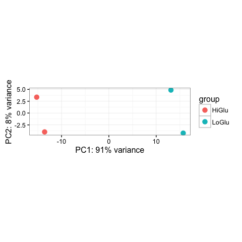
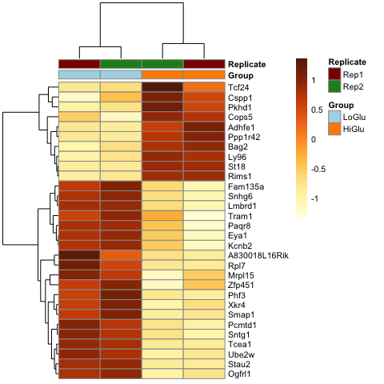
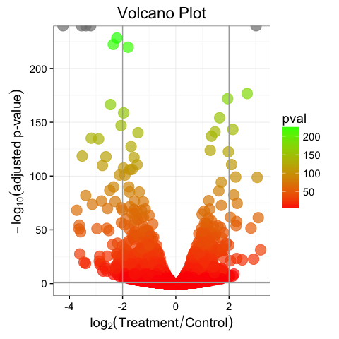
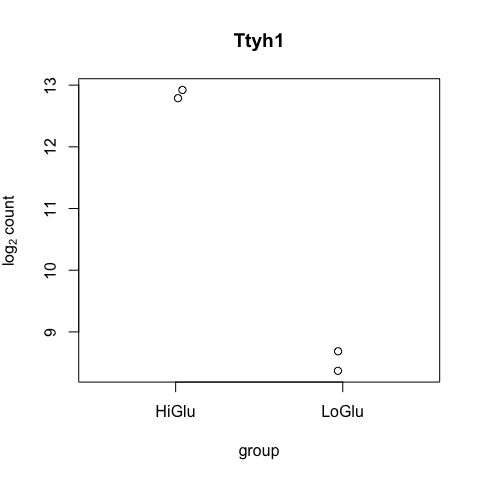
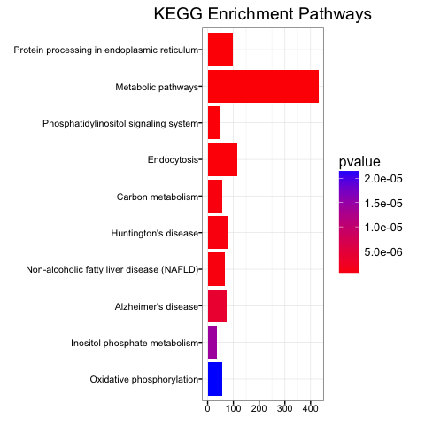
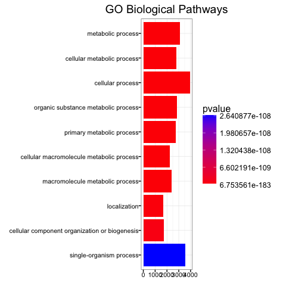

RNAseq Workflow
================
Thomas W. Battaglia
14 Sept 2016

### Introduction

RNA seq is an emerging technology for deep RNA sequencing. Not only does RNA seq technology have the ability to analyze differences in gene expression between samples, but can discover new isoforms of genes and analyze SNP variation of particular genes. This tutorial will cover the basic workflow for analyzing RNA seq data on host tissue. It will not cover the workflow for analyzing RNA seq on microbial community samples. For analysis of the meta-transcriptome using RNA seq, see the workflow for Whole Genome Sequencing Metagenomics.

### 1. Setup new bio-cookie template for a new RNAseq analysis

The easiest way to set up the RNAseq environment is by using a bio-cookie template. This template will download all the necessary tools into a new virtual environment, so that there are no disruptions with your current computer packaging versions. It is high reccomended to run on all of these commands on a high performance cluster.

The template will also ask if you would like to download a human or mouse genome for transcriptome alignment. If you want to align to a genome which is neither human or murine, then you must select "None" in the option and download the genome and annotation file separately. Below are a list of the tools which are downloaded during the installation steps. See here for a list of availabel genomes (<https://genome.ucsc.edu/cgi-bin/hgGateway> / <http://useast.ensembl.org/info/data/ftp/index.html> )

#### 1a. Load python version 2.7 or higher

``` bash
# Load python 2.7.3 on cluster (if needed)
module load python/2.7.3

# Make sure python 2.7.3 was installed into environment
python --version
>> Python 2.7.3
```

#### 1b. Install cookiecutter template engine

``` bash
# add --user if you are working on a HPC environment
pip install cookiecutter --user
```

#### 1c. Set up bio-cookie-WMS environment.

Be sure to choose the correct options related to your data. For more information see: <https://github.com/twbattaglia/bio-cookie-RNAseq>

``` bash
# Generate a bio-cookie RNAseq template project
cookiecutter https://github.com/twbattaglia/bio-cookie-RNAseq

Tools that are downloaded during bio-cookie creation:
a. cutadapt - adapter and base quality filtering
b. FastQC - sequence quality analysis
c. Trim Galore! - more easily run cutadapt and fastqc
d. SortMeRNA - remove rRNA sequence contamination
e. STAR-aligner - quickly align sequences to genome
f. Subread/featureCounts - summarize alignments into gene counts
g. MultiQC - generate a readable report of all logs
```

#### 1d. Change directory into the new folder

``` bash
# This folder name will different depending upon the name chosen when running bio-cookie-RNAseq
cd new_rnaseq_analysis/
```

### 2. Generate STAR aligner index

The STAR aligner requires an index to be created before aligning any `fastq` sequences. The index command requires the host genome of interest and associated annotation file as inputs. The command is best run when submitted as a job. Download the shell file and submit it as a job. Additionally you must specific the length of the sequences in the RNAseq run in the command. This is typically 50 or 101, but will depend on what was requested.

``` bash
# Submit the make_index.sh as a job. This can take ~20 minutes to finish.
qsub make_index.sh
```

### 3. Run the workflow in parallel

The job can be submitted to the cluster once you generated a STAR-aligner index and you have placed the `.fastq.gz` files into the folder, `input`.

The command is written to submit an array job, which means you must specify how many times the job should run. In this case it is dependent upon how many individual `.fastq.gz` files that are located in the `input` folder. If there are 6 different samples within the folder you would run the command `qsub -t 1:6 run_workflow.sh`, but if you have 10 files, you would run the command `qsub -t 1:10 run_workflow.sh`. The `-t` flag corresponds to how many different commands (files) should be submitted.

``` bash
# Submit the array workflow script
qsub -t 1:4 run_workflow.sh
```

**Note:** The command is written for SGE clusters, but if you have a different cluster set up, you can change the variable `$SGE_TASK_ID` to the correct array style variable.

### 4. Process the output files and generate a report

After the main workflow has finished running, you will have generated aligned `.bam` files for each sample. These files only give the coordinates for the sequence alignments on the genome, and must be summarized to give gene counts per sample, before any statistical analysis can be performed. To do this we perform further processing the output files using the `postprocessing.sh` script There is no need for a parallel array script and the command can be submitted as is as long as no folder names/locations were not changed in main workflow step.

``` bash
# Submit the postprocesing.sh script as a job. This should take ~10 minutes.
qsub postprocessing.sh
```

Once completed, many files are generated after running the main workflow and the post-processing scripts. Below is a breakdown of each of the folders and their respective description of their outputs. Each step reports a log file for every sample which can be used to calculcated the number of sequences.

``` bash
── output/
  │   └── 1_initial_qc/ - FastQC quality reports for each sample
  │   └── 2_trimmed_output/ - Trimmed reports for each sample
  │   └── 3_rRNA
  │       ├── aligned/ - Sequences aligned to rRNA databases
  │       ├── filtered/ - Sequences with rRNA sequences removed
  │       ├── logs/ - Logs from running SortMeRNA
  │   └── 4_aligned_sequences
  │       ├── aligned_bam/ - Main alignment files for each sample
  │       ├── aligned_logs/ - Log from running STAR alignment step
  │       ├── aligned_counts/ - STAR alignment counts output (for comparison with featureCounts)
  │   └── 5_final_counts - Final gene count summarization output from running featureCounts
  │   └── 6_multiQC - Overall workflow report
```

### 5. Differential expression analysis using R

Once the workflow has completed, you can now use the gene count table as an input into DESeq2 for statistical analysis using the R-programming language. It is highly reccomended to use **RStudio** when writing R code and generating R-related analyses. You can download RStudio for your system here: <https://www.rstudio.com/products/rstudio/download/>

#### 5a. Install required R-libraries

Multiple libraries are required to perform analysis, plotting and enrichment.

``` r
source("https://bioconductor.org/biocLite.R")
biocLite("DESeq2")
biocLite("ggplot2")
biocLite("clusterProfiler")
biocLite("biomaRt")
biocLite("ReactomePA")
biocLite("DOSE")
biocLite("KEGG.db")
biocLite("pathview")
biocLite("org.Mm.eg.db")
biocLite("org.Hs.eg.db")
biocLite("pheatmap")
biocLite("genefilter")
biocLite("RColorBrewer")
biocLite("GO.db")
biocLite("topGO")
biocLite("dplyr")
```

#### 5b. Import featureCounts output

One you have an R environment appropriatley set up, you can begin to import the featureCounts output of genes counts, found within the `5_final_counts` folder. This tutorial will use DESeq2 to normalize and perform the statistical analysis between sample groups. Be sure to copy the `final_counts.txt` file generate from featureCounts step to your set working directory, or specify the full location when importing the table. <br>
If you would like to use an example dataset, download the gene counts and metadata below (**Right click --&gt; Save as**) :
[Download gene counts per sample](https://raw.githubusercontent.com/twbattaglia/RNAseq-workflow/master/example/final_counts.txt)
[Download sample metadata](https://raw.githubusercontent.com/twbattaglia/RNAseq-workflow/master/example/metadata.txt)
[Download R script of all commands shown below](https://raw.githubusercontent.com/twbattaglia/RNAseq-workflow/master/example/rnaseq_commands.R)

``` r
library(DESeq2) # statistical analysis 
library(ggplot2) # plotting 
library(knitr) # for better formatting

# Import gene counts table
# - skip first row (general command info)
# - make row names the gene identifiers
countdata <- read.table("example/final_counts.txt", header = TRUE, skip = 1, row.names = 1)

# Remove .bam + '..' from column identifiers
colnames(countdata) <- gsub(".bam", "", colnames(countdata), fixed = T)
colnames(countdata) <- gsub("..", "", colnames(countdata), fixed = T)

# Remove length/char columns
countdata <- countdata[ ,c(-1:-5)]

# Make sure ID's are correct
head(countdata)
```

    ##               SRR1374924 SRR1374923 SRR1374921 SRR1374922
    ## 4933401J01Rik          0          0          0          0
    ## Gm26206                0          0          0          0
    ## Xkr4                 214        302        459        425
    ## Gm18956                0          0          0          0
    ## Gm37180                4          2          3          1
    ## Gm37363                1          0          0          1

#### 5c. Import metadata text file. The SampleID's must be the first column.

``` r
# Import metadata file
# - make row names the matching sampleID's from the countdata
metadata <- read.delim("example/metadata.txt", row.names = 1)

# Add sampleID's to the mapping file
metadata$sampleid <- row.names(metadata)

# Reorder sampleID's to match featureCounts column order. 
metadata <- metadata[match(colnames(countdata), metadata$sampleid), ]

# Make sure ID's are correct
head(metadata)
```

    ##            Group Replicate   sampleid
    ## SRR1374924 HiGlu      Rep2 SRR1374924
    ## SRR1374923 HiGlu      Rep1 SRR1374923
    ## SRR1374921 LoGlu      Rep1 SRR1374921
    ## SRR1374922 LoGlu      Rep2 SRR1374922

#### 5d. Make DESeq2 object from counts and metadata

``` r
# - countData : count dataframe
# - colData : sample metadata in the dataframe with row names as sampleID's
# - design : The design of the comparisons to use. 
#            Use (~) before the name of the column variable to compare
ddsMat <- DESeqDataSetFromMatrix(countData = countdata,
                                 colData = metadata,
                                 design = ~Group)


# Find differential expressed genes
# Run DESEq2
ddsMat <- DESeq(ddsMat)
```

    ## estimating size factors

    ## estimating dispersions

    ## gene-wise dispersion estimates

    ## mean-dispersion relationship

    ## final dispersion estimates

    ## fitting model and testing

#### 5e. Get basic statisics about the number of significant genes

``` r
# Get results from testing with FDR adjust pvalues
res <- results(ddsMat, pAdjustMethod = "fdr", alpha = 0.05)

# Generate summary of testing. 
summary(res)
```

    ## 
    ## out of 28681 with nonzero total read count
    ## adjusted p-value < 0.05
    ## LFC > 0 (up)     : 3093, 11% 
    ## LFC < 0 (down)   : 2424, 8.5% 
    ## outliers [1]     : 0, 0% 
    ## low counts [2]   : 12328, 43% 
    ## (mean count < 9)
    ## [1] see 'cooksCutoff' argument of ?results
    ## [2] see 'independentFiltering' argument of ?results

### 6. Annotate gene symbols

After aligment and summarization, we only have the annotated gene symbols. To get more information about significant genes, we can use annoated databases to convert gene symbols to full gene names and entrez ID's for further analysis.

#### 6a. Gathering gene annotation information

``` r
library(AnnotationDbi)
library(org.Mm.eg.db)

# Add gene full name
res$description <- mapIds(x = org.Mm.eg.db,
                          keys = row.names(res),
                          column = "GENENAME",
                          keytype = "SYMBOL",
                          multiVals = "first")

# Add gene symbol
res$symbol <- row.names(res)

# Add ENTREZ ID
res$entrez <- mapIds(x = org.Mm.eg.db,
                     keys = row.names(res),
                     column = "ENTREZID",
                     keytype = "SYMBOL",
                     multiVals = "first")

# Subset for only significant genes (q < 0.05)
res_sig <- subset(res, padj < 0.05)
head(res_sig)
```

    ## log2 fold change (MAP): Group LoGlu vs HiGlu 
    ## Wald test p-value: Group LoGlu vs HiGlu 
    ## DataFrame with 6 rows and 9 columns
    ##         baseMean log2FoldChange      lfcSE       stat       pvalue
    ##        <numeric>      <numeric>  <numeric>  <numeric>    <numeric>
    ## Xkr4    343.8983      0.6473508 0.16708763   3.874319 1.069232e-04
    ## Mrpl15  862.4650      0.4024633 0.11708712   3.437298 5.875488e-04
    ## Tcea1   934.4692      1.3999089 0.11330340  12.355400 4.554828e-35
    ## St18   4875.8787     -0.9960725 0.06734494 -14.790606 1.684298e-49
    ## Pcmtd1 2073.1050      0.3941010 0.08469429   4.653218 3.267944e-06
    ## Sntg1   477.0359      0.7368634 0.14501538   5.081278 3.749043e-07
    ##                padj
    ##           <numeric>
    ## Xkr4   5.981918e-04
    ## Mrpl15 2.729132e-03
    ## Tcea1  3.475809e-33
    ## St18   2.314565e-47
    ## Pcmtd1 2.548435e-05
    ## Sntg1  3.487378e-06
    ##                                                                         description
    ##                                                                         <character>
    ## Xkr4                           X Kell blood group precursor related family member 4
    ## Mrpl15                                          mitochondrial ribosomal protein L15
    ## Tcea1                                     transcription elongation factor A (SII) 1
    ## St18                                               suppression of tumorigenicity 18
    ## Pcmtd1 protein-L-isoaspartate (D-aspartate) O-methyltransferase domain containing 1
    ## Sntg1                                                           syntrophin, gamma 1
    ##             symbol      entrez
    ##        <character> <character>
    ## Xkr4          Xkr4      497097
    ## Mrpl15      Mrpl15       27395
    ## Tcea1        Tcea1       21399
    ## St18          St18      240690
    ## Pcmtd1      Pcmtd1      319263
    ## Sntg1        Sntg1       71096

#### 6b. Write all the important results to .txt files

``` r
# Write normalized gene counts to a .txt file
write.table(x = as.data.frame(counts(ddsMat), normalized = T), 
            file = 'DESeq2_normalized_counts.txt', 
            sep = '\t', 
            quote = F,
            col.names = NA)

# Write significant normalized gene counts to a .txt file
write.table(x = counts(ddsMat[row.names(res_sig)], normalized = T), 
            file = 'DESeq2_normalized_counts_significant.txt', 
            sep = '\t', 
            quote = F, 
            col.names = NA)

# Write the annotated results table to a .txt file
write.table(x = as.data.frame(res), 
            file = "DESEq2_results_gene_annotated.txt", 
            sep = '\t', 
            quote = F,
            col.names = NA)

# Write significant annotated results table to a .txt file
write.table(x = as.data.frame(res_sig), 
            file = "DESEq2_results_gene_annotated_significant.txt", 
            sep = '\t', 
            quote = F,
            col.names = NA)
```

### 7. Plotting gene information

There are multiple ways to plot gene expression data. Below we are only listing a few popular methods, but there are many more resources (found in section 9 below) that will walk through different R commands/packages for plotting.

#### 7a. PCA plot

``` r
# Convert all samples to rlog
ddsMat_rlog <- rlog(ddsMat, blind = FALSE)

# Plot PCA by column variable
plotPCA(ddsMat_rlog, intgroup = "Group", ntop = 500) +
  theme_bw() # remove default ggplot2 theme
```



#### 7b. Heatmap plot

``` r
# Load libraries
library(pheatmap) 
library(RColorBrewer) 

# Convert all samples to rlog
ddsMat_rlog <- rlog(ddsMat, blind = FALSE)

# Gather top 30 genes and make matrix
mat <- assay(ddsMat_rlog[row.names(res_sig)])[1:30, ]

# Choose which column variables you want to annotate the columns by.
annotation_col = data.frame(
  Group = factor(colData(ddsMat_rlog)$Group),
  Replicate = factor(colData(ddsMat_rlog)$Replicate),
  row.names = colData(ddsMat_rlog)$sampleid
)

# Specify colors you want to annotate the columns by.
ann_colors = list(
  Group = c("LoGlu" = "lightblue", "HiGlu" = "darkorange"),
  Replicate = c(Rep1 = "darkred", Rep2 = "forestgreen")
)

# Make Heatmap with pheatmap function.
# See more in documentation for customization
pheatmap(mat = mat, 
         color = colorRampPalette(brewer.pal(9, "YlOrBr"))(255), 
         scale = "row", 
         annotation_col = annotation_col, 
         annotation_colors = ann_colors, 
         fontsize = 8,
         show_colnames = F)
```



#### 7c. Volcano plot

``` r
# Load libraries
library(ggplot2)
library(RColorBrewer)

# Gather Log-fold change and FDR-corrected pvalues from deseq2 results
data <- data.frame(pval = -log10(res$padj), 
                   lfc = res$log2FoldChange, 
                   row.names = row.names(res))

# Remove any rows that have NA as an entry
data <- na.omit(data)

# Make a basic ggplot2 object with x-y values
vol <- ggplot(data, aes(x = lfc, y = pval))

# Add ggplot2 layers
vol +   
  ggtitle(label = "Volcano Plot") +
  geom_point(aes(colour = pval), size = 5, alpha = 0.7, na.rm = T) + # color the dots
  theme_bw(base_size = 14) + # change overall theme
  theme(legend.position = "right") + # change the legend
  xlab(expression(log[2]("Treatment" / "Control"))) + # Change X-Axis label
  ylab(expression(-log[10]("adjusted p-value"))) + # Change Y-Axis label
  geom_vline(xintercept = c(-2, 2), colour = "darkgrey") + # Add fold change cutoff lines
  geom_hline(yintercept = 1.3, colour = "darkgrey") + # Add p-adj value cutoff line
  scale_colour_gradient(low = "red", high = "green") # Add red-green scaling by intensity
```

 []('figures/volcano_plot.png')

#### 7c. MA plot

``` r
plotMA(res, ylim = c(-5, 5))
```


#### 7c. Single gene plot

``` r
# Convert all samples to rlog
ddsMat_rlog <- rlog(ddsMat, blind = FALSE)

# Get gene with highest expression
top_gene <- rownames(res)[which.min(res$log2FoldChange)]

# Plot single gene
plotCounts(ddsMat, gene = top_gene, 
           intgroup = "Group", 
           normalized = T, 
           transform = T)
```

 []('figures/single_gene_plot.png')

### 8. Pathway enrichment analysis

Pathway enrichment analysis is a great way to generate overall conclusions based on the individual gene changes. Sometimes individiual gene changes are overwheling and are difficult to interpret. But by analyzing which genes may fall into different pathways, we can get a better idea of what mRNA changes in relation to phenotype are occuring. More information about clusterProfiler here: <http://bioconductor.org/packages/release/bioc/vignettes/clusterProfiler/inst/doc/clusterProfiler.html>

#### 8a. Set up matrix to take into account entrezID's and fold change for each gene

``` r
# Load required libraries
library(clusterProfiler)
library(ReactomePA)
library(KEGG.db)
library(DOSE)
library(org.Mm.eg.db)

# Remove any genes that do not have any entrez identifiers
res_sig_entrez <- subset(res_sig, is.na(entrez) == FALSE)

# Create a matrix of gene log2 fold changes
gene_matrix <- res_sig_entrez$log2FoldChange

# Add the entrezID's as names for each logFC entry
names(gene_matrix) <- res_sig_entrez$entrez
```

#### 8a. Enrich genes using the KEGG database

``` r
kegg_enrich <- enrichKEGG(gene = names(gene_matrix),
                          organism = 'mouse',
                          pvalueCutoff = 0.05, 
                          readable = TRUE)

# Plot results
barplot(kegg_enrich, 
        drop = TRUE, 
        showCategory = 10, 
        title = "KEGG Enrichment Pathways",
        font.size = 8)
```



#### 8a. Enrich genes using the Gene Onotlogy

``` r
go_enrich <- enrichGO(gene = names(gene_matrix), 
                      organism = 'mouse', 
                      readable = T,
                      ont = "BP",
                      pvalueCutoff = 0.05)

# Plot results
barplot(go_enrich, 
        drop = TRUE, 
        showCategory = 10, 
        title = "GO Biological Pathways",
        font.size = 8)
```



#### 8c. Plotting pathways with pathview

``` r
# Load pathview
library(pathview)

# Plot specific KEGG pathways (with fold change) 
# pathway.id : KEGG pathway identifier
pathview(gene.data = gene_matrix, 
         pathway.id = "04070", 
         species = "mouse", 
         map.symbol = T)
```


### 9. Going further with RNAseq analysis

You can the links below for a more in depth walk through of RNAseq analysis using R:
<http://www.bioconductor.org/help/workflows/rnaseqGene/>
<http://bioconnector.org/workshops/r-rnaseq-airway.html>
<http://www-huber.embl.de/users/klaus/Teaching/DESeq2Predoc2014.html>
<http://www-huber.embl.de/users/klaus/Teaching/DESeq2.pdf>
<https://web.stanford.edu/class/bios221/labs/rnaseq/lab_4_rnaseq.html>
<http://www.rna-seqblog.com/which-method-should-you-use-for-normalization-of-rna-seq-data/>
<http://www.rna-seqblog.com/category/technology/methods/data-analysis/data-visualization/> <http://www.rna-seqblog.com/category/technology/methods/data-analysis/pathway-analysis/> <http://www.rna-seqblog.com/inferring-metabolic-pathway-activity-levels-from-rna-seq-data/>

### Citations:

1.  Andrews S. (2010). FastQC: a quality control tool for high throughput sequence data. Available online at: <http://www.bioinformatics.babraham.ac.uk/projects/fastqc>

2.  Martin, Marcel. Cutadapt removes adapter sequences from high-throughput sequencing reads. EMBnet.journal, \[S.l.\], v. 17, n. 1, p. pp. 10-12, may. 2011. ISSN 2226-6089. Available at: <http://journal.embnet.org/index.php/embnetjournal/article/view/200>. <doi:http://dx.doi.org/10.14806/ej.17.1.200>.

3.  Kopylova E., Noé L. and Touzet H., "SortMeRNA: Fast and accurate filtering of ribosomal RNAs in metatranscriptomic data", Bioinformatics (2012), doi: 10.1093/bioinformatics/bts611

4.  Dobin A, Davis CA, Schlesinger F, et al. STAR: ultrafast universal RNA-seq aligner. Bioinformatics. 2013;29(1):15-21. <doi:10.1093/bioinformatics/bts635>.

5.  Lassmann et al. (2010) "SAMStat: monitoring biases in next generation sequencing data." Bioinformatics <doi:10.1093/bioinformatics/btq614> \[PMID: 21088025\]

6.  Liao Y, Smyth GK and Shi W (2014). featureCounts: an efficient general purpose program for assigning sequence reads to genomic features. Bioinformatics, 30(7):923-30.

7.  Love MI, Huber W and Anders S (2014). “Moderated estimation of fold change and dispersion for RNA-seq data with DESeq2.” Genome Biology, 15, pp. 550.

8.  Yu G, Wang L, Han Y and He Q (2012). “clusterProfiler: an R package for comparing biological themes among gene clusters.” OMICS: A Journal of Integrative Biology, 16(5), pp. 284-287.

9.  Philip Ewels, Måns Magnusson, Sverker Lundin and Max Käller. "MultiQC: Summarize analysis results for multiple tools and samples in a single report" Bioinformatics (2016). doi: 10.1093/bioinformatics/btw354. PMID: 27312411
